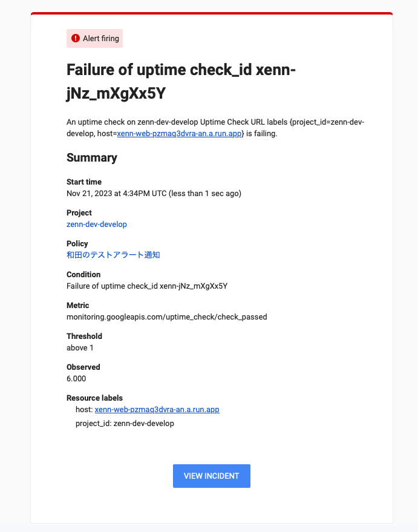

# Cloud Run ハンズオン

## はじめに

このチュートリアルではブログ投稿サンプルサイト、「Xenn」をデプロイします。最低限の操作ができるAPIとWebサイトをデプロイし、触りながら機能を加えていきます。

- 前半: アプリケーションを Google Cloud へデプロイする
- 後半: エディタで編集しながら機能を変更してみる

大まかに上記のような構成になっています。それでは始めましょう。

## セットアップ（API）

Google Cloud のリソースを操作できるようにするため、以下のコマンドでサービスを有効にします。ハンズオン開始時に一度実行すればOKです。


```sh
gcloud services enable \
  run.googleapis.com \
  artifactregistry.googleapis.com \
  cloudbuild.googleapis.com \
  pubsub.googleapis.com \
  sqladmin.googleapis.com \
  resourcesettings.googleapis.com
```

## セットアップ（設定）

Cloud Shell でコマンドを実行するときの設定です。セッションごとにリセットされるため、Cloud Shellを再起動した場合などは、こちらのコマンドを再度実行してください。

### **gcloud コマンドの初期化**

```sh
gcloud config set run/region asia-northeast1
gcloud config set run/platform managed
```

ここではリージョンを東京、プラットフォームをフルマネージドに設定しました。この設定を行うことで、gcloud コマンドから Cloud Run を操作するときに毎回指定する必要がなくなります。

### **環境変数の設定**

TerraformやCloud Runをデプロイする際に必要となる環境変数を設定します。

```sh
export RAILS_MASTER_KEY=e1bcaa95519afaa1c20c33e25a846f4a
export GITHUB_REPOSITORY_NAME=google-cloud-workshop-202311-xenn
export TF_VAR_gcp_project_id=$GOOGLE_CLOUD_PROJECT
export TF_VAR_primary_region="asia-northeast1"
export CLOUD_SQL_CONNECTION_HOST="/cloudsql/${GOOGLE_CLOUD_PROJECT}:$TF_VAR_primary_region:xenn-db"
export CLOUD_SQL_INSTANCE_NAME=$GOOGLE_CLOUD_PROJECT:$TF_VAR_primary_region:xenn-db
export XENN_CLOUD_RUN_SERVICE_ACCOUNT="xenn-cloud-run-runner@${GOOGLE_CLOUD_PROJECT}.iam.gserviceaccount.com"
export XENN_CLOUD_RUN_SERVICE_ACCOUNT="xenn-cloud-run-runner@${GOOGLE_CLOUD_PROJECT}.iam.gserviceaccount.com"
```

## Terraform の利用開始

まずは Google Cloud のリソースを Terraform でデプロイしてみましょう。

### **初期化**

```sh
cd ~/$GITHUB_REPOSITORY_NAME/infra
terraform init
```

### **Cloud Run 用 サービスアカウントの設定**

こちらのコマンドでサービスアカウントを作成しつつ、Terraformが実行できることを確認します。

```sh
cd ~/$GITHUB_REPOSITORY_NAME/infra
terraform apply -target module.cloud-run
```

- `yes` と入力しEnter
- 警告が表示されますが問題ありません

## 他のリソースの作成

コードで管理されているすべてのリソースを作成します。以下のリソースが対象です:

- Cloud SQL（PostgreSQL）
- Artifact Registry

```sh
cd ~/$GITHUB_REPOSITORY_NAME/infra
terraform apply
```

- `yes` と入力しEnter
- 最大10分ほどかかりますのでそのまま待ちます

## チェックポイント

ここまでの状態を整理します。

- Terraform とは
- Terraformを使って作成したもの
- どこまでTerraformで管理するか：アプリケーションのライフサイクルを考える
- infra構成、Terraformの考え方、modules、環境変数

## データベースユーザーの作成

データベースが作成されたら、ユーザーを作成します（デフォルトのpostgresデータベースをそのまま利用します）。

```bash
gcloud sql users create postgres \
  --instance=xenn-db \
  --password=handson
```

### **DBに接続できることを確認**

以下のコマンドを実行してDBに接続します。

```sh
gcloud sql connect xenn-db --user=postgres --database=postgres
# password: handson
# postgres => \dt
```

何かしらテーブル情報が返ってくればOKです。exitを入力してpostgresクライアントを抜けてください。

```sh
exit
```

## APIアプリケーションのデプロイ

Ruby on Rails を Cloud Run へデプロイします。

1. Cloud Build コマンドを使って Dockerfile からイメージ作成、Artifact Registry へプッシュ
2. 1でプッシュしたイメージを使って Cloud Run Jobs をデプロイ
3. 1でプッシュしたイメージを使って Cloud Run サービスをデプロイ

```sh
cd ~/$GITHUB_REPOSITORY_NAME/api && \
gcloud builds submit . \
--tag asia-northeast1-docker.pkg.dev/$GOOGLE_CLOUD_PROJECT/xenn-repo/xenn-api && \

gcloud run jobs deploy rails-command \
--quiet \
--project=$GOOGLE_CLOUD_PROJECT \
--image=asia-northeast1-docker.pkg.dev/$GOOGLE_CLOUD_PROJECT/xenn-repo/xenn-api \
--service-account=$XENN_CLOUD_RUN_SERVICE_ACCOUNT \
--set-cloudsql-instances=$CLOUD_SQL_INSTANCE_NAME \
--cpu=1 \
--task-timeout=60m \
--max-retries=0 \
--parallelism=1 \
--set-env-vars=RAILS_ENV=production \
--set-env-vars=RAILS_MASTER_KEY=$RAILS_MASTER_KEY \
--set-env-vars=CLOUD_SQL_CONNECTION_HOST=$CLOUD_SQL_CONNECTION_HOST \
--command=bundle,exec,rails \
--args=db:migrate,db:migrate:status && \

gcloud run deploy xenn-api \
--image=asia-northeast1-docker.pkg.dev/$GOOGLE_CLOUD_PROJECT/xenn-repo/xenn-api \
--service-account=$XENN_CLOUD_RUN_SERVICE_ACCOUNT \
--add-cloudsql-instances=$CLOUD_SQL_INSTANCE_NAME \
--allow-unauthenticated \
--set-env-vars=RAILS_ENV=production \
--set-env-vars=RAILS_MASTER_KEY=$RAILS_MASTER_KEY \
--set-env-vars=CLOUD_SQL_CONNECTION_HOST=$CLOUD_SQL_CONNECTION_HOST
```

## チェックポイント

ここまでの状態を整理します。

- コマンドの意味、それぞれのコマンドで作成されるもの
- 何に使うのか

## DBマイグレーションの実行

デプロイした Cloud Run Jobs を使い、DBマイグレーションを実行します。

```sh
gcloud run jobs execute rails-command --wait
```

テーブルが作成されたことを確認してみます。

```sh
gcloud sql connect xenn-db --user=postgres --database=postgres
# password: handson
# postgres => \dt
```

articlesテーブルが含まれていればOKです。articlesテーブルは、Ruby on Rails のDBマイグレーションコマンドで作成されます。Cloud Run Jobs で DBマイグレーションコマンドが実行され、Cloud SQL と繋がっていることを意味します。

exitを入力してpostgresクライアントを抜けてください。

```sh
exit
```

### **curl リクエスト実行**

デプロイした Cloud Run へ APIリクエストが実行できることを確認します。

```sh
XENN_API_ROOT_URL=$(gcloud run services describe xenn-api --region asia-northeast1 --format json | jq -r '.status.url')
curl $XENN_API_ROOT_URL/articles
```

空配列のレスポンスが帰ってくればOKです。

### **DBデータSEEDの実行**

データベースにテストデータを投入します。

```sh
gcloud run jobs execute rails-command --wait \
--args=db:seed
```

データが投入された状態でもう一度APIリクエストを実行します。

```sh
XENN_API_ROOT_URL=$(gcloud run services describe xenn-api --region asia-northeast1 --format json | jq -r '.status.url')
curl $XENN_API_ROOT_URL/articles
```

空配列ではなくテストデータが返ってくればOKです。

## Webアプリケーションのデプロイ

Next.js を Cloud Run へデプロイします。

### **バックエンドアプリのURLを.envへ反映**

以下のコマンドを実行して、.env.productionを作成します。

```sh
XENN_API_ROOT_URL=$(gcloud run services describe xenn-api --region asia-northeast1 --format json | jq -r '.status.url')
cd ~/$GITHUB_REPOSITORY_NAME/web && \
cat << EOF > .env.production
NEXT_PUBLIC_API_ROOT=$XENN_API_ROOT_URL
EOF
```

### **デプロイ**

以下のコマンドを実行して、Next.jsアプリケーションをデプロイします。

```sh
cd ~/$GITHUB_REPOSITORY_NAME/web && \
gcloud builds submit . \
--tag asia-northeast1-docker.pkg.dev/$GOOGLE_CLOUD_PROJECT/xenn-repo/xenn-web && \

gcloud run deploy xenn-web \
--quiet \
--image=asia-northeast1-docker.pkg.dev/$GOOGLE_CLOUD_PROJECT/xenn-repo/xenn-web \
--service-account=$XENN_CLOUD_RUN_SERVICE_ACCOUNT \
--no-use-http2 \
--allow-unauthenticated
```

表示されたURLへアクセスし、Xennのサイトが表示されれば成功です。何も見えない、という場合はアドレスバーに `/articles` を追加して遷移してみてください。これでアプリケーションが連携されました。お疲れ様でした。

## いろいろためす

Xennの機能をひととおり触ってみましょう。

- 記事の一覧
- 記事の詳細
- 新しい記事の作成

Google Cloud Console で作成されたリソースを画面からみてみましょう。

- Google Cloud Console で Cloud SQL をのぞいてみる
- Google Cloud Console で Cloud Run をのぞいてみる

このようなことをやってみましょう。

## アプリ修正: 編集ボタンが見えるように

Next.js を修正して再デプロイする一連の流れを試してみましょう。コメントアウトされた記述を編集し、Cloud Run へ修正をデプロイします。

### **修正（画面説明）**

- Cloud Shell でエディタを開く
- `web/src/app/articles/[slug]/page.tsx` を修正する

### **再デプロイ**

最初のデプロイ時と同じコマンドでOKです。

```sh
cd ~/$GITHUB_REPOSITORY_NAME/web && \
gcloud builds submit . \
--tag asia-northeast1-docker.pkg.dev/$GOOGLE_CLOUD_PROJECT/xenn-repo/xenn-web && \

gcloud run deploy xenn-web \
--quiet \
--image=asia-northeast1-docker.pkg.dev/$GOOGLE_CLOUD_PROJECT/xenn-repo/xenn-web \
--service-account=$XENN_CLOUD_RUN_SERVICE_ACCOUNT \
--no-use-http2 \
--allow-unauthenticated
```

記事の詳細画面で、編集ボタンが見えるようになり、記事の編集が実行できれば成功です。

## アプリ修正: パフォーマンスUP

### **修正（準備）**

```sh
cd ~/$GITHUB_REPOSITORY_NAME/api
touch db/migrate/20231122144137_add_body_html_to_article.rb
```

以下のようにDBのマイグレーションファイルを修正します。コピーしてください。

```ruby
class AddBodyHtmlToArticle < ActiveRecord::Migration[7.1]
  def change
    add_column :articles, :body_html, :text
  end
end
```

### **修正（画面説明）**

記事詳細画面の表示速度を上げるために、Next.jsで MarkdownをHTMLへ変換しているところ、Markdown保存時にHTMLを変換してDBへ保存することにしました。画面の説明に従い、以下を修正してください。

- Articleモデルを修正
  - Rails で Markdown を保存するときにHTMLへ変換して保存するよう修正
  - 外部のMarkdown変換ロジック（Cloud Functions）を使う
- HTMLを返すようにシリアライザ・コントローラーを修正
- Next.js でHTMLを使い、変換ロジックは破棄するように修正

### 再デプロイ

**前回デプロイ時と同じコマンドでデプロイします。**

```sh
cd ~/$GITHUB_REPOSITORY_NAME/api && \
gcloud builds submit . \
--tag asia-northeast1-docker.pkg.dev/$GOOGLE_CLOUD_PROJECT/xenn-repo/xenn-api && \

gcloud run jobs deploy rails-command \
--quiet \
--project=$GOOGLE_CLOUD_PROJECT \
--image=asia-northeast1-docker.pkg.dev/$GOOGLE_CLOUD_PROJECT/xenn-repo/xenn-api \
--service-account=$XENN_CLOUD_RUN_SERVICE_ACCOUNT \
--set-cloudsql-instances=$CLOUD_SQL_INSTANCE_NAME \
--cpu=1 \
--task-timeout=60m \
--max-retries=0 \
--parallelism=1 \
--set-env-vars=RAILS_ENV=production \
--set-env-vars=RAILS_MASTER_KEY=$RAILS_MASTER_KEY \
--set-env-vars=CLOUD_SQL_CONNECTION_HOST=$CLOUD_SQL_CONNECTION_HOST \
--command=bundle,exec,rails \
--args=db:migrate,db:migrate:status && \

gcloud run deploy xenn-api \
--image=asia-northeast1-docker.pkg.dev/$GOOGLE_CLOUD_PROJECT/xenn-repo/xenn-api \
--service-account=$XENN_CLOUD_RUN_SERVICE_ACCOUNT \
--add-cloudsql-instances=$CLOUD_SQL_INSTANCE_NAME \
--allow-unauthenticated \
--set-env-vars=RAILS_ENV=production \
--set-env-vars=RAILS_MASTER_KEY=$RAILS_MASTER_KEY \
--set-env-vars=CLOUD_SQL_CONNECTION_HOST=$CLOUD_SQL_CONNECTION_HOST
```

### **DBマイグレーションの実行**

デプロイした Cloud Run Jobs を使い、DBマイグレーションを実行します。

```sh
gcloud run jobs execute rails-command --wait
```

### **アプリケーションを利用する**

- 新しい記事が作成できることを確認してください
- 既存の記事の内容が表示されなくなります。編集からそのまま保存しなおすことでHTMLが生成されることを確認してください

## 稼働時間チェックによる監視の追加

Cloud Monitoring でエンドポイントを監視し、異常があれば通知を贈ることができます。試しましょう。

1. [Cloud Monitoringの稼働時間チェック](https://console.cloud.google.com/monitoring/uptime?cloudshell=false&hl=ja)を開きます
2. 稼働時間チェックを作成します
  - protocol: HTTPS
  - リソースの種類: URL
  - Hostname: Cloud Run（Next.js） のドメインを入力
  - Path: articles
3. レスポンスの検証はそのままでOK
4. アラートと通知
  - 名前だけ自分のものとわかるようにしてください。例: `和田のテストアラート通知`
  - Duration: 1 minute
  - 通知チャンネル: 新しく作成します。Eメールでご自身が受け取れるアドレスをご指定ください。ちょっと遠慮したい場合は別途お知らせします。
5. 確認
  - 名前は `Xennトップページの稼働チェック` などとしてください
  - TEST を実行してパスすることを確認します（失敗した場合はもう一度試してください）
6. CREATE

### **Cloud SQL をわざと停止する**

この状態でデータベースを停止するとどうなるかみてみましょう。Google Cloud Console で Cloud SQL のページへ行きます。

**DBを停止します。業務や個人でGoogle Cloudを利用している方は、対象のプロジェクトが合っているか今一度確認してください。**

`■停止` を押して停止します。

- DBへクエリを送るRails APIでエラー
- Rails API を使う Next.js でエラー
- 稼働時間チェックにひっかかり、メールが送信される

以上が確認できればOKです。



## Extra Stage

もしも早く終わった場合、以下の追加修正にチャレンジしてみてください。

- ブログトップページの下部にある Next.js の残骸を消す
- Terraform で Cloud Storage の パブリックバケットを作成し、そこへアップロードした画像のURLを取得、そのURLを Markdown へ埋め込んで記事に画像が表示されることを確認する
- 記事の削除を行えるようにする

### **さらなる高みを目指す方へ１**
**ローカルマシンで `git clone` を行う**

- api/ `docker compose run api bundle install`
- api/ `docker compose up`
- api/ `docker compose exec api rails db:migrate`
- api/ `docker compose exec api rails db:seed`
- web/ `yarn install`, `yarn dev`
- `http://localhost:3000` で表示されれば成功です


### **さらなる高みを目指す方へ２**

GitHub アカウントが必要になります。GitHub にコードをプッシュすると、自動でデプロイできるように構成できます。Zennはそのような構成です。調べてチャレンジしてみましょう。

- リポジトリを fork する
- cloudbuild.yml を作成し、ビルド・デプロイの処理をひとまとめにする
- GitHub リポジトリ と Cloud Build を連携する
- main ブランチに push すると 自動で Ruby on Rails が Cloud Run へデプロイされるようにする

## 後片付け

最後に、作成したリソースを消しましょう。

### **稼働時間チェックを削除**

[ここから](https://console.cloud.google.com/monitoring/uptime?cloudshell=false&hl=ja)削除します。

### **Cloud Run の削除**

```sh
gcloud run services delete xenn-web && \
gcloud run services delete xenn-api
```

### **Terraformで作成したリソースの削除**

```sh
cd ~/$GITHUB_REPOSITORY_NAME/infra
terraform destroy
```

おつかれさまでした。
